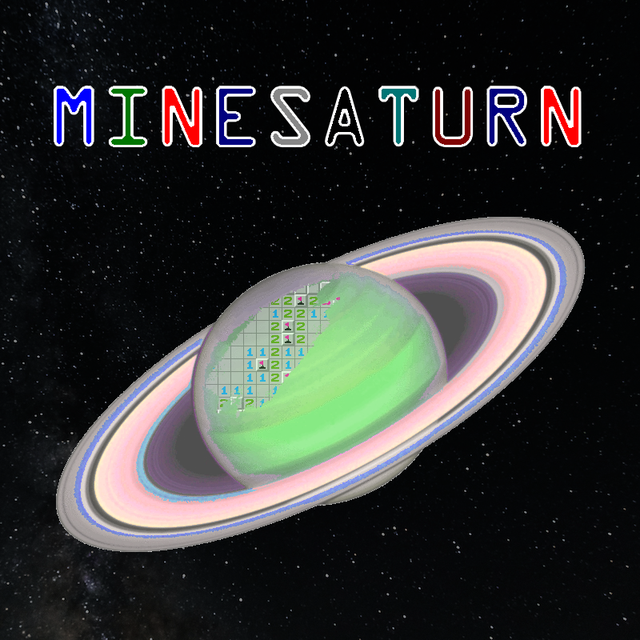

## Introduction

MineSaturn is a self-learning Minesweeper AI developed entirely by Derek Stephens. No external libraries, no frameworks, just pure cosmic magic. It solves Minesweeper boards faster and more accurately than humans (see below), and can be customized to provide a unique experience.

## History

I originally came up with the idea for MineSaturn during a 2024 semester abroad in South Korea. At the time, I had neither the hours nor motivation to undertake such a project, so I shelved it. Then, later that year, Hack@Davidson announced the theme for their 2025 Hackathon: puzzles. I immediately recognized MineSaturn as the perfect project for such an event. So, I promised to realize MineSaturn during that weekend in February.

The Hackathon went extraordinarily well and MineSaturn took its initial form, although it was not yet self-learning, and had multiple debilitating bugs. I submitted MineSaturn for the Best Game and Best AI awards, but won neither. As I lamented to a friend afterwards:

>It was a Game and an AI, but not game enough for 'Best Game' and not AI enough for 'Best AI.'

In the following months, I continued to enhance MineSaturn until it became a product I was happy with. Now, I release it to you all as an open-source application to toy around with.

## Code

MineSaturn is written entirely in Java, my favorite language. It learns by identifying patterns as it plays, giving each one a higher score when it guesses a cell correctly and a lower score when it loses (incorrectly flagging a cell is counted as an instant loss). In this way, it is a form of evolutionary algorithm, although not a particularly sophisticated one.

## Results

Success in Minesweeper is often measured in "mastery," or the number of wins out of 100 games in a row. Both the hard-coded and self-learning programs played 1000 games of Beginner (9x9 w/ 10 mines), Intermediate (16x16 w/ 40 mines), and Expert (30x16 w/ 99 mines). Their top mastery for each difficulty is recorded below, alongside some public statistics and my own best scores.

| Difficulty | Hard-Coded | Self-Learning | `minesweeper.online` Average Win Rate | Derek's High | World Record |
| - | - | - | - | - | - |
| Beginner | ??? | ??? | 50.3% | 94 | 100 |
| Intermediate | ??? | ??? | 24.4% | 58 | 93 |
| Expert | ??? | ??? | 2.8% | 24 | 57 |
